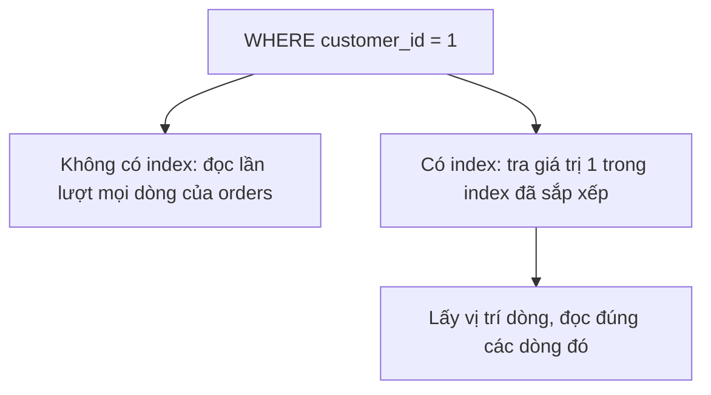

Bảng đơn hàng có vài triệu dòng. Câu truy vấn tìm đơn của một khách mất 5 giây, vì
Oracle phải đọc từng dòng để so `customer_id`. Index giúp Oracle đi thẳng tới
đúng những dòng cần tìm.

## Khái niệm

🔍 **Full table scan**: cách Oracle đọc lần lượt mọi dòng của bảng để tìm dòng thoả điều kiện.

📇 **Index**: cấu trúc dữ liệu phụ lưu sẵn giá trị của một hay nhiều cột theo thứ tự, kèm vị trí dòng, để tìm theo cột đó mà không phải đọc cả bảng.



## Ví dụ

```sql
CREATE INDEX idx_orders_customer
  ON orders (customer_id);
```

- Từ đây, câu `WHERE customer_id = 1` dùng được index thay vì đọc cả bảng.
- Oracle tự tạo index cho khoá chính và cột `UNIQUE`.
- Khoá ngoại **không** tự có index. Cột khoá ngoại hay dùng để `JOIN` nên
  thường cần tạo index.
- Index có giá: tốn thêm dung lượng, và mỗi lần `INSERT`, `UPDATE`,
  `DELETE` Oracle phải cập nhật cả index.

## Thử ngay

Tạo index rồi xem bảng `orders` có index trên những cột nào:

```sql
CREATE INDEX idx_orders_customer
  ON orders (customer_id);

SELECT column_name
FROM user_ind_columns
WHERE table_name = 'ORDERS'
ORDER BY column_name;
```

`user_ind_columns` là view hệ thống của Oracle, liệt kê cột của các index
thuộc user đang đăng nhập.

**Đoán trước khi chạy:** bạn chỉ tạo một index. Kết quả có mấy dòng?

<details>
<summary>Xem kết quả</summary>

| COLUMN_NAME |
|---|
| CUSTOMER_ID |
| ORDER_ID |

Hai dòng. `CUSTOMER_ID` là index vừa tạo. `ORDER_ID` là index Oracle tự tạo
cho khoá chính từ lúc tạo bảng.

</details>

## Lỗi hay gặp

**Bọc hàm quanh cột trong `WHERE`.** Index lưu giá trị gốc của
`order_date`, không lưu kết quả của `TRUNC(order_date)`, nên Oracle không
dùng được index và phải đọc cả bảng.

```sql
-- SAI — hàm quanh cột làm mất tác dụng của index
SELECT order_id FROM orders
WHERE TRUNC(order_date) = DATE '2025-01-05';
```

```sql
-- ĐÚNG — so sánh trực tiếp trên cột
SELECT order_id FROM orders
WHERE order_date >= DATE '2025-01-05'
  AND order_date <  DATE '2025-01-06';
```

**Tạo index cho mọi cột.** Việc đọc có nhanh hơn một chút, nhưng mỗi lần ghi
dữ liệu lại chậm đi vì Oracle phải cập nhật quá nhiều index. Chỉ tạo index cho cột hay dùng
trong `WHERE` và `JOIN`.

## Tóm tắt

- Không có index thì Oracle đọc cả bảng để tìm.
- Index giúp tìm nhanh theo cột, đổi lại tốn dung lượng và làm ghi chậm hơn.
- Khoá chính và `UNIQUE` tự có index, khoá ngoại thì không.
- Đừng bọc hàm quanh cột có index trong `WHERE`.

```quiz
[
  {
    "prompt": "Trang tìm khách theo email chạy chậm, bảng customers có 2 triệu dòng. Nên làm gì trước tiên?",
    "options": [
      "Tạo index cho mọi cột của customers",
      "Xoá bớt khách",
      "Tạo index trên cột email",
      "Đổi email sang kiểu NUMBER"
    ],
    "answer": 3,
    "explain": "Câu tìm lọc theo email, nên index trên email giúp Oracle không phải đọc cả 2 triệu dòng."
  },
  {
    "prompt": "Có index trên cột name. Câu nào KHÔNG dùng được index đó?",
    "options": [
      "WHERE UPPER(name) = 'AN'",
      "WHERE name = 'An'",
      "WHERE name IN ('An', 'Bình')",
      "WHERE name LIKE 'An%'"
    ],
    "answer": 1,
    "explain": "UPPER(name) là giá trị đã qua hàm, không có sẵn trong index. Ba câu còn lại so sánh trực tiếp trên name."
  },
  {
    "prompt": "Vì sao không nên tạo index cho mọi cột?",
    "options": [
      "Vì Oracle giới hạn mỗi bảng một index",
      "Vì index làm SELECT chậm đi",
      "Vì index chỉ dùng được với số",
      "Vì mỗi lần ghi dữ liệu phải cập nhật mọi index, làm ghi chậm và tốn dung lượng"
    ],
    "answer": 4,
    "explain": "Index tăng tốc đọc nhưng có giá khi ghi. Chỉ tạo cho cột hay dùng trong WHERE và JOIN."
  }
]
```
