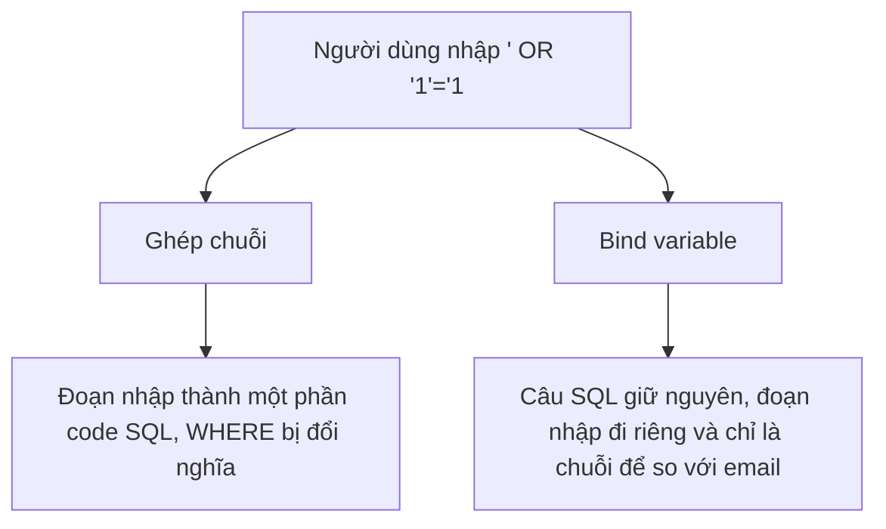

Trang tra cứu đơn hàng cho khách nhập email. Code ghép chuỗi email đó vào câu
SQL rồi chạy. Một người gõ vào ô email một đoạn SQL thay vì email, và thế là
họ đọc được thông tin của mọi khách. Đó là SQL injection, một lỗi bảo mật rất
phổ biến.

## Khái niệm

💉 **SQL injection**: kiểu tấn công chèn đoạn SQL vào dữ liệu người dùng nhập, khiến câu lệnh làm việc khác với ý định.

🧷 **Bind variable (tham số)**: chỗ giữ trong câu SQL như `:email`, giá trị được gửi riêng nên Oracle luôn coi là dữ liệu, không bao giờ coi là code SQL.

## Ví dụ

Code C# ghép chuỗi:

```csharp
// SAI — ghép thẳng dữ liệu người dùng vào SQL
string sql =
    "SELECT name FROM customers WHERE email = '"
    + email + "'";
```

Người dùng nhập `' OR '1'='1`, câu SQL thành:

```sql
-- SAI — điều kiện luôn đúng
SELECT name FROM customers
WHERE email = '' OR '1'='1';
```

Dùng bind variable với thư viện `Oracle.ManagedDataAccess`:

```csharp
// ĐÚNG — email được gửi riêng, không ghép vào SQL
using Oracle.ManagedDataAccess.Client;

var cmd = new OracleCommand(
    "SELECT name FROM customers WHERE email = :email",
    conn);
cmd.Parameters.Add(new OracleParameter("email", email));
```

- `:email` là chỗ giữ, giá trị thật truyền qua `Parameters`.
- Người dùng gõ gì vào ô email thì Oracle cũng chỉ coi đó là một chuỗi để
  so sánh.
- Bind variable còn giúp Oracle dùng lại kế hoạch thực thi khi cùng một câu
  SQL chạy với giá trị khác nhau, nên nhanh hơn.
- Truy vấn EF Core viết bằng LINQ tự dùng tham số. Lỗi chỉ xảy ra khi bạn tự
  viết SQL thô bằng cách ghép chuỗi.



## Thử ngay

Chạy thử câu SQL mà kẻ tấn công tạo ra:

```sql
SELECT name
FROM customers
WHERE email = '' OR '1'='1'
ORDER BY customer_id;
```

**Đoán trước khi chạy:** không ai có email rỗng. Câu này trả về mấy khách?

<details>
<summary>Xem kết quả</summary>

| NAME |
|---|
| An |
| Bình |
| Chi |
| Dũng |

Cả bốn khách. `'1'='1'` luôn đúng, nối bằng `OR` nên điều kiện đúng với mọi
dòng. Thông tin của mọi khách bị lộ chỉ vì một ô nhập liệu.

</details>

## Lỗi hay gặp

**Ghép chuỗi vì "dữ liệu này an toàn".** Hôm nay giá trị đến từ code, mai có
người đổi thành lấy từ ô nhập liệu. Luôn dùng bind variable cho mọi giá trị
đưa vào SQL.

**Tự lọc dấu nháy thay vì dùng tham số.** Tự thay `'` bằng `''` dễ sót trường
hợp và không chặn được mọi kiểu tấn công.

```csharp
// SAI — tự "làm sạch" vẫn là ghép chuỗi
string safe = email.Replace("'", "''");
string sql =
    "SELECT name FROM customers WHERE email = '"
    + safe + "'";
```

Chỉ bind variable mới tách hẳn dữ liệu khỏi code SQL.

## Tóm tắt

- SQL injection xảy ra khi dữ liệu người dùng được ghép thẳng vào câu SQL.
- Kẻ tấn công chèn đoạn như `' OR '1'='1` để đổi ý nghĩa câu lệnh.
- Dùng bind variable (`:ten`) cho mọi giá trị, không tự ghép chuỗi.
- EF Core với LINQ đã tự dùng tham số.

```quiz
[
  {
    "prompt": "Câu SQL nào an toàn trước SQL injection?",
    "options": [
      "\"... WHERE code = '\" + input + \"'\"",
      "\"... WHERE code = '\" + input.Replace(\"'\", \"''\") + \"'\"",
      "\"... WHERE code = :code\" kèm tham số code",
      "\"... WHERE code = \" + input"
    ],
    "answer": 3,
    "explain": "Chỉ bind variable gửi dữ liệu tách khỏi câu SQL. Mọi cách ghép chuỗi đều có thể bị chèn code."
  },
  {
    "prompt": "Ô tìm kiếm ghép thẳng vào SQL. Người dùng nhập ' OR '1'='1. Chuyện gì xảy ra?",
    "options": [
      "Điều kiện luôn đúng, câu lệnh trả về mọi dòng",
      "Oracle tự chặn, báo lỗi",
      "Không tìm thấy gì",
      "Chỉ trả về dòng có dấu nháy"
    ],
    "answer": 1,
    "explain": "Đoạn nhập vào đóng chuỗi rồi thêm OR '1'='1', làm điều kiện WHERE đúng với mọi dòng."
  },
  {
    "prompt": "Dự án dùng EF Core, viết truy vấn bằng LINQ như db.Customers.Where(c => c.Email == email). Có bị SQL injection không?",
    "options": [
      "Có, vì email do người dùng nhập",
      "Có, EF Core luôn ghép chuỗi",
      "Chỉ bị nếu email có dấu nháy",
      "Không, EF Core tự chuyển email thành tham số"
    ],
    "answer": 4,
    "explain": "EF Core dịch LINQ thành SQL có tham số. Nguy cơ chỉ còn khi tự viết SQL thô bằng cách ghép chuỗi."
  }
]
```
