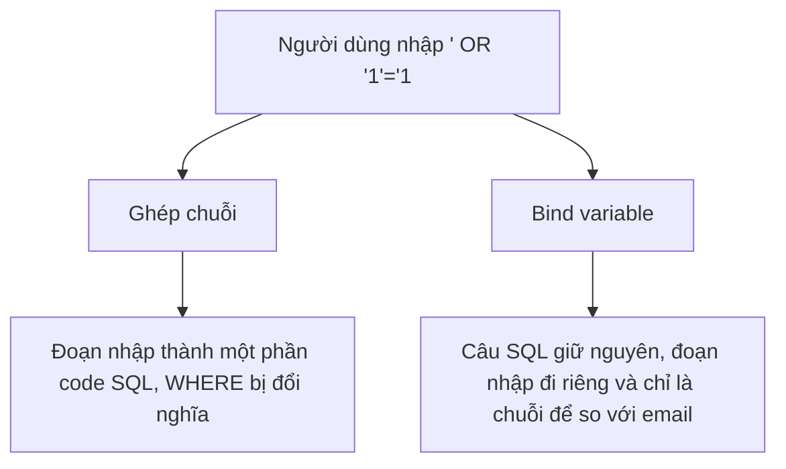

Trang tra cứu đơn hàng cho khách nhập email. Code ghép chuỗi email đó vào câu
SQL rồi chạy. Một người gõ vào ô email một đoạn SQL thay vì email, và thế là
họ đọc được thông tin của mọi khách. Đó là SQL injection, một lỗi bảo mật rất
phổ biến.

## Khái niệm

🧨 **SQL injection**: kiểu tấn công chèn đoạn SQL vào dữ liệu người dùng nhập, khiến câu lệnh làm việc khác với ý định.

🧷 **Bind variable (tham số)**: chỗ giữ trong câu SQL như `:email`, giá trị được gửi riêng nên Oracle luôn coi là dữ liệu, không bao giờ coi là code SQL.

## Ví dụ

Code C# ghép chuỗi:

```csharp
// SAI — ghép thẳng dữ liệu người dùng vào SQL
string sql =
    "SELECT name FROM customers WHERE email = '"
    + email + "'";
```

Viết bằng `$"... '{email}'"` (string interpolation ở khoá C# Core) cũng là
ghép chuỗi, nguy hiểm y hệt. Người dùng nhập `' OR '1'='1`, câu SQL thành:

```sql
-- SAI — điều kiện luôn đúng
SELECT name FROM customers
WHERE email = '' OR '1'='1';
```

Dùng bind variable với thư viện `Oracle.ManagedDataAccess.Core`:

```csharp
// ĐÚNG — email được gửi riêng, không ghép vào SQL
using Oracle.ManagedDataAccess.Client;

var cmd = new OracleCommand(
    "SELECT name FROM customers WHERE email = :email",
    conn);
cmd.Parameters.Add(new OracleParameter("email", email));
```

`conn` là kết nối đã mở tới Oracle. Đoạn C# này chỉ để đọc hiểu; muốn chạy
thật thì cần package NuGet `Oracle.ManagedDataAccess.Core`.

- `:email` là chỗ giữ, giá trị thật truyền qua `Parameters`.
- Người dùng gõ gì vào ô email thì Oracle cũng chỉ coi đó là một chuỗi để
  so sánh.
- Bind variable còn giúp Oracle dùng lại cách chạy đã tính cho câu SQL đó
  khi chỉ có giá trị thay đổi, nên nhanh hơn.



## Thử ngay

Chạy thử câu SQL mà kẻ tấn công tạo ra:

```sql
SELECT name
FROM customers
WHERE email = '' OR '1'='1'
ORDER BY customer_id;
```

**Đoán trước khi chạy:** không ai có email rỗng. Câu này trả về mấy khách?

<details>
<summary>Xem kết quả</summary>

| NAME |
|---|
| An |
| Bình |
| Chi |
| Dũng |

Cả bốn khách. `'1'='1'` luôn đúng, nối bằng `OR` nên điều kiện đúng với mọi
dòng. Thông tin của mọi khách bị lộ chỉ vì một ô nhập liệu.

</details>

## Lỗi hay gặp

**Ghép chuỗi vì "dữ liệu này an toàn".** Hôm nay giá trị đến từ code, mai có
người đổi thành lấy từ ô nhập liệu. Luôn dùng bind variable cho mọi giá trị
đưa vào SQL.

**Tự lọc dấu nháy thay vì dùng tham số.** Tự thay `'` bằng `''` chặn được ví
dụ trên, nhưng dễ quên ở một chỗ nào đó, và không giúp gì khi giá trị ghép vào
không nằm trong nháy, như một con số.

```csharp
// SAI — tự "làm sạch" vẫn là ghép chuỗi
string safe = email.Replace("'", "''");
string sql =
    "SELECT name FROM customers WHERE email = '"
    + safe + "'";
```

```csharp
// ĐÚNG — không tự thay dấu nháy, dùng tham số
using Oracle.ManagedDataAccess.Client;

var cmd = new OracleCommand(
    "SELECT name FROM customers WHERE email = :email",
    conn);
cmd.Parameters.Add(new OracleParameter("email", email));
```

Bind variable tách hẳn dữ liệu khỏi code SQL, nên không cần tự lọc gì.

## Tóm tắt

- SQL injection xảy ra khi dữ liệu người dùng được ghép thẳng vào câu SQL.
- Kẻ tấn công chèn đoạn như `' OR '1'='1` để đổi ý nghĩa câu lệnh.
- Dùng bind variable (`:ten`) cho mọi giá trị, không tự ghép chuỗi.
- Tự lọc dấu nháy không thay được bind variable.

```quiz
[
  {
    "prompt": "Câu SQL nào an toàn trước SQL injection?",
    "options": [
      "\"... WHERE code = :code\"",
      "\"... WHERE code = '\" + input + \"'\"",
      "\"... WHERE code = '\" + input.Replace(\"'\", \"''\") + \"'\"",
      "\"... WHERE code = \" + input"
    ],
    "answer": 1,
    "explain": "Bind variable gửi dữ liệu tách khỏi câu SQL. Tự thay dấu nháy vẫn dễ sót, còn ghép giá trị không có nháy như phương án cuối thì không chặn được gì."
  },
  {
    "prompt": "Ô tìm kiếm ghép thẳng vào SQL. Người dùng nhập ' OR '1'='1. Chuyện gì xảy ra?",
    "options": [
      "Oracle tự chặn, báo lỗi",
      "Điều kiện luôn đúng, câu lệnh trả về mọi dòng",
      "Không tìm thấy gì",
      "Chỉ trả về dòng có dấu nháy"
    ],
    "answer": 2,
    "explain": "Đoạn nhập vào đóng chuỗi rồi thêm OR '1'='1', làm điều kiện WHERE đúng với mọi dòng."
  },
  {
    "prompt": "Ngoài chặn SQL injection, bind variable còn giúp gì?",
    "options": [
      "Tự thêm index cho bảng",
      "Tự COMMIT sau mỗi câu lệnh",
      "Chạy lại câu SQL nhanh hơn",
      "Cho phép bỏ qua WHERE"
    ],
    "answer": 3,
    "explain": "Câu SQL giữ nguyên, chỉ giá trị thay đổi, nên Oracle dùng lại cách chạy đã tính, không phải phân tích lại câu lệnh mỗi lần."
  }
]
```
