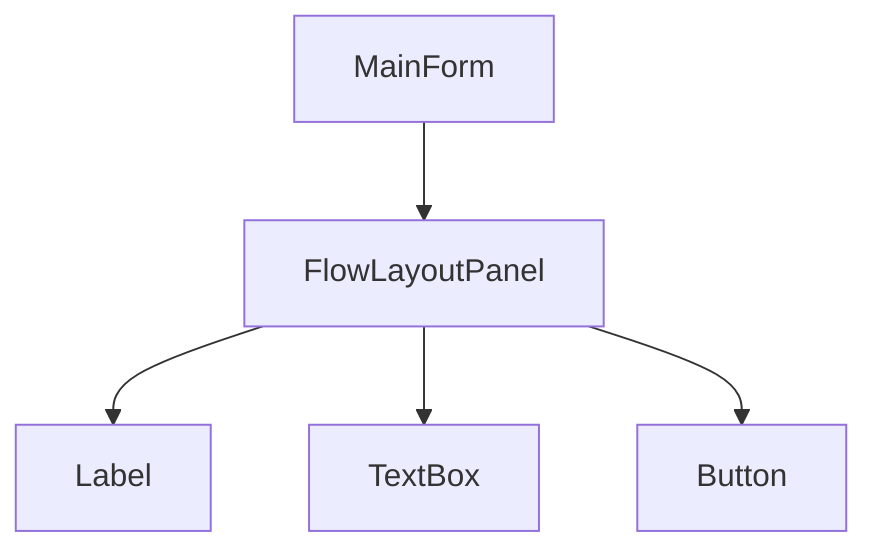

Cửa sổ trống chưa làm được gì. Muốn nhập tên sản phẩm cần một ô nhập, muốn
lưu cần một nút. Bài này thêm các thành phần đó vào form và để WinForms tự xếp
chúng.

## Khái niệm

🔘 **Control**: object hiển thị trên cửa sổ, như nhãn `Label`, ô nhập `TextBox`, nút bấm `Button`.

📥 **Controls**: property chứa danh sách control con của một form hoặc một panel.

Control chỉ hiện ra khi đã được thêm vào danh sách này.

🪜 **FlowLayoutPanel**: control chứa các control khác và tự xếp chúng nối tiếp nhau, không cần đặt toạ độ.

Form chứa panel, panel chứa nhãn và nút. Đây là composition như bài
Composition của khoá OOP: object lớn được ghép từ các object nhỏ.

## Ví dụ

Giữ nguyên class `Program`, thay class `MainForm` bằng:

```csharp
class MainForm : Form
{
    public MainForm()
    {
        Text = "Thêm sản phẩm";
        Width = 320;
        Height = 220;

        var panel = new FlowLayoutPanel
        {
            Dock = DockStyle.Fill,
            FlowDirection = FlowDirection.TopDown,
            Padding = new Padding(12)
        };

        var nameLabel = new Label
        {
            Text = "Tên sản phẩm",
            AutoSize = true
        };
        var nameBox = new TextBox { Width = 250 };
        var saveButton = new Button { Text = "Lưu" };

        panel.Controls.Add(nameLabel);
        panel.Controls.Add(nameBox);
        panel.Controls.Add(saveButton);
        Controls.Add(panel);
    }
}
```

- `Label` hiện chữ, `TextBox` cho gõ chữ, `Button` là nút bấm.
- `FlowDirection.TopDown` xếp từ trên xuống. Thứ tự hiện ra là thứ tự `Add`.
- `Dock = DockStyle.Fill` cho panel phủ kín form, kéo giãn cửa sổ thì panel
  giãn theo.
- `Padding` chừa khoảng trống 12 điểm ảnh quanh mép panel.
- Dòng cuối `Controls.Add(panel)` gắn panel vào form.



## Thử ngay

Xoá dòng cuối `Controls.Add(panel);` rồi chạy lại.

**Đoán trước khi chạy:** chương trình báo lỗi, hay cửa sổ vẫn mở nhưng thiếu
gì đó?

<details>
<summary>Xem kết quả</summary>

```text
Không có lỗi. Cửa sổ "Thêm sản phẩm" mở ra nhưng trống trơn.
```

Panel và ba control vẫn được tạo, chỉ là chưa gắn vào form. Object tồn tại
trong bộ nhớ không có nghĩa là nó nằm trên cửa sổ.

</details>

## Lỗi hay gặp

**Chữ của `Label` bị cắt.** `Label` mặc định rộng cố định 100 điểm ảnh,
chữ dài hơn thế bị cắt mất.

```csharp
// SAI — chỉ thấy một phần chữ
var priceLabel = new Label
{
    Text = "Giá bán (VNĐ, chưa gồm VAT)"
};
```

```csharp
// ĐÚNG — nhãn tự rộng theo chữ
var priceLabel = new Label
{
    Text = "Giá bán (VNĐ, chưa gồm VAT)",
    AutoSize = true
};
```

## Tóm tắt

- Control là object: `Label`, `TextBox`, `Button`, tạo bằng `new`.
- Control chỉ hiện khi được `Add` vào `Controls` của form hoặc panel.
- `FlowLayoutPanel` tự xếp control theo thứ tự `Add`.
- `Dock = DockStyle.Fill` cho control phủ kín vùng chứa nó.
- `Label` nên có `AutoSize = true` để không bị cắt chữ.

```quiz
[
  {
    "prompt": "Tạo var noteBox = new TextBox(); trong constructor nhưng chạy lên không thấy ô nhập đâu. Thiếu gì?",
    "options": [
      "Thiếu AutoSize = true",
      "Thiếu [STAThread]",
      "Thiếu Controls.Add(noteBox) hoặc panel.Controls.Add(noteBox)",
      "TextBox phải khai báo là field"
    ],
    "answer": 3,
    "explain": "Control chỉ hiện khi nằm trong danh sách Controls của form hoặc của một panel đang ở trên form."
  },
  {
    "prompt": "FlowLayoutPanel TopDown lần lượt Add nút Lưu, ô nhập, nhãn. Trên cửa sổ, cái gì ở trên cùng?",
    "options": [
      "Nhãn",
      "Ô nhập",
      "Tuỳ kích thước từng control",
      "Nút Lưu"
    ],
    "answer": 4,
    "explain": "FlowLayoutPanel xếp theo thứ tự Add. Nút Lưu được Add đầu tiên nên nằm trên cùng."
  },
  {
    "prompt": "Kéo cửa sổ to ra, panel vẫn giữ nguyên kích thước nhỏ ở góc. Nên sửa thế nào?",
    "options": [
      "Đặt Dock = DockStyle.Fill cho panel",
      "Tăng Padding của panel",
      "Đổi FlowDirection",
      "Thêm AutoSize cho form"
    ],
    "answer": 1,
    "explain": "Dock = DockStyle.Fill làm panel phủ kín form và giãn theo khi cửa sổ đổi kích thước."
  }
]
```
