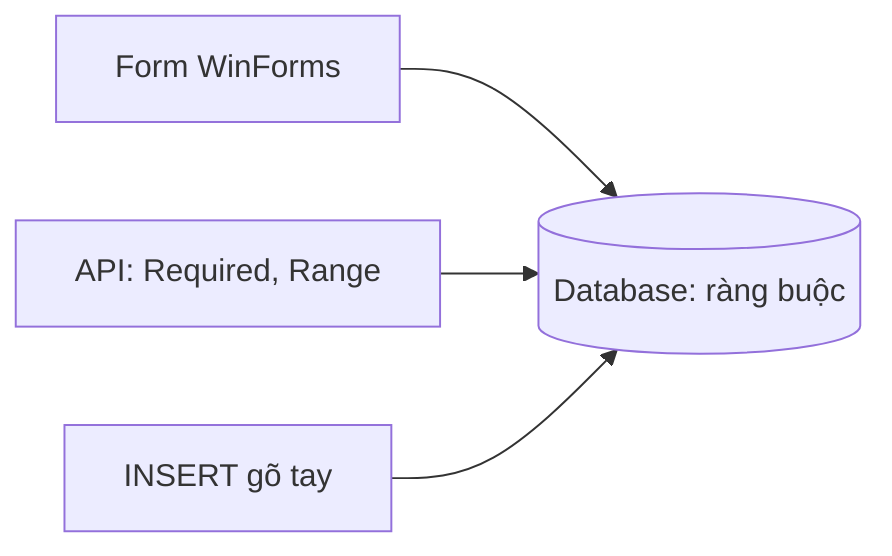

Nhân viên có thể bấm "Lưu" khi chưa gõ tên, hoặc gõ giá bằng chữ. Bài này
dùng ô nhập chỉ nhận số và báo lỗi ngay cạnh ô sai, trước khi dữ liệu đi tới
database.

## Khái niệm

🔢 **NumericUpDown**: ô nhập chỉ nhận số, giá trị đọc qua property `Value` kiểu `decimal`, giới hạn bởi `Minimum` và `Maximum`.

⚠️ **ErrorProvider**: component hiện biểu tượng lỗi cạnh một control, rê chuột vào biểu tượng thì thấy lời nhắn.

Dữ liệu sản phẩm được kiểm ở ba nơi. Form báo sớm cho người nhập. API có
`[Required]`, `[Range]` như bài Validation của khoá ASP.NET Core. Database có
ràng buộc như `NOT NULL`, `CHECK` ở bài CREATE TABLE và ràng buộc của khoá
SQL, làm chốt chặn cuối cùng cho những gì bảng đã khai báo.



## Ví dụ

```csharp
class MainForm : Form
{
    private readonly TextBox _nameBox =
        new TextBox { Width = 250 };
    private readonly NumericUpDown _priceBox =
        new NumericUpDown
        {
            Maximum = 100000000,
            Increment = 1000,
            Width = 250
        };
    private readonly ErrorProvider _errors =
        new ErrorProvider();

    public MainForm()
    {
        Text = "Thêm sản phẩm";

        var panel = new FlowLayoutPanel
        {
            Dock = DockStyle.Fill,
            FlowDirection = FlowDirection.TopDown,
            Padding = new Padding(12)
        };
        var saveButton = new Button { Text = "Lưu" };
        saveButton.Click += SaveButton_Click;

        panel.Controls.Add(_nameBox);
        panel.Controls.Add(_priceBox);
        panel.Controls.Add(saveButton);
        Controls.Add(panel);
    }

    private void SaveButton_Click(
        object? sender, EventArgs e)
    {
        _errors.Clear();
        if (_nameBox.Text.Trim() == "")
        {
            _errors.SetError(_nameBox, "Nhập tên");
            return;
        }
        if (_priceBox.Value <= 0)
        {
            _errors.SetError(_priceBox, "Giá phải > 0");
            return;
        }
        Text = $"Đã lưu {_nameBox.Text}";
    }
}
```

- `NumericUpDown` chặn phím chữ ngay khi gõ. `Value` là `decimal`, cùng kiểu
  với `Price` của `Product`.
- `SetError(control, lời nhắn)` hiện biểu tượng lỗi cạnh control đó.
  `Clear()` xoá mọi lỗi cũ trước mỗi lần kiểm.
- `return` dừng handler ngay ở lỗi đầu tiên, nên dữ liệu sai không bao giờ
  tới dòng lưu.

## Thử ngay

Chạy app, để trống tên, giữ giá là 0, rồi bấm "Lưu". Sau đó gõ tên "Bút bi"
và bấm "Lưu" lần nữa.

**Đoán trước khi chạy:** lần bấm đầu có mấy biểu tượng lỗi? Lần bấm thứ hai
thì biểu tượng lỗi nằm ở đâu?

<details>
<summary>Xem kết quả</summary>

```text
Lần 1: một biểu tượng lỗi, cạnh ô tên ("Nhập tên").
Lần 2: biểu tượng cạnh ô tên biến mất,
       một biểu tượng mới hiện cạnh ô giá ("Giá phải > 0").
```

Lần đầu, `return` dừng ngay sau lỗi tên nên chưa kiểm tới giá. Lần hai,
`Clear()` xoá lỗi cũ, tên đã hợp lệ, handler đi tiếp và gặp lỗi giá.

</details>

## Lỗi hay gặp

**Quên đặt `Maximum`.** `NumericUpDown` mặc định chỉ cho tối đa 100. Gõ giá
5000 rồi rời ô, giá tự bị kéo về 100 mà không báo gì.

```csharp
// SAI — giá lớn hơn 100 bị kéo về 100
var priceBox = new NumericUpDown { Width = 250 };
```

```csharp
// ĐÚNG — đặt giới hạn theo nghiệp vụ
var priceBox = new NumericUpDown
{
    Maximum = 100000000,
    Width = 250
};
```

**Chỉ kiểm ở form.** Đường ghi khác, như API hay một câu `INSERT` gõ tay,
không đi qua form nên vẫn ghi được dữ liệu sai vào database. Kiểm ở form để
báo sớm, còn ràng buộc trong database vẫn phải giữ.

## Tóm tắt

- `NumericUpDown` cho nhập số, đọc bằng `Value` kiểu `decimal`.
- Luôn đặt `Maximum`, vì mặc định chỉ là 100.
- `ErrorProvider.SetError` báo lỗi cạnh control, `Clear()` xoá lỗi cũ.
- Kiểm ở form để báo sớm, database vẫn giữ ràng buộc làm chốt cuối.

```quiz
[
  {
    "prompt": "Ô số lượng là NumericUpDown chưa đặt Maximum. Nhân viên gõ 250 rồi bấm sang ô khác. Value là bao nhiêu?",
    "options": [
      "250",
      "0",
      "100",
      "Báo lỗi và giữ nguyên chữ 250"
    ],
    "answer": 3,
    "explain": "Maximum mặc định là 100, giá trị vượt quá bị kéo về đúng Maximum."
  },
  {
    "prompt": "Form đã kiểm giá > 0. Bảng products có cần thêm CHECK (price > 0) nữa không?",
    "options": [
      "Có, vì API hay câu SQL gõ tay không đi qua form",
      "Không, kiểm hai lần là thừa",
      "Không, CHECK làm chậm database",
      "Không, NumericUpDown đã chặn số âm"
    ],
    "answer": 1,
    "explain": "Form chỉ chặn được dữ liệu đi qua chính nó. Ràng buộc trong database chặn mọi đường ghi."
  },
  {
    "prompt": "Handler gọi SetError cho ô tên ở lần bấm trước. Lần này tên đã đúng. Muốn biểu tượng lỗi cũ biến mất, cần gì?",
    "options": [
      "Không cần gì, nó tự biến mất",
      "Tạo ErrorProvider mới",
      "Đóng form rồi mở lại",
      "Gọi Clear() hoặc SetError(ô tên, \"\") đầu handler"
    ],
    "answer": 4,
    "explain": "ErrorProvider giữ lỗi tới khi bị xoá. Clear() xoá tất cả, SetError với chuỗi rỗng xoá lỗi của một control."
  }
]
```
