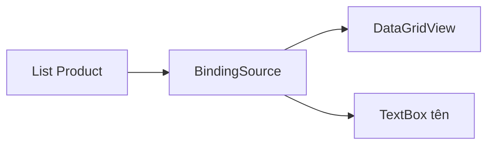

Ở bài trước, thêm sản phẩm vào `List<Product>` mà lưới không hiện dòng mới.
Màn hình kho còn cần một ô nhập luôn hiện tên của sản phẩm đang chọn trên
lưới.
`BindingSource` giải quyết cả hai việc.

## Khái niệm

🔄 **BindingSource**: object đứng giữa danh sách dữ liệu và các control, báo cho control khi dữ liệu đổi và giữ dòng đang chọn trong property `Current`.

🪢 **Data binding**: nối một property của control với một property của object, sửa bên này thì bên kia đổi theo.



## Ví dụ

```csharp
class MainForm : Form
{
    private readonly BindingSource _source =
        new BindingSource();

    public MainForm()
    {
        Text = "Kho hàng";
        Width = 500;
        _source.DataSource = new List<Product>
        {
            new Product
            {
                Id = 1, Name = "Bút bi", Price = 5000m
            },
            new Product
            {
                Id = 2, Name = "Vở", Price = 12000m
            }
        };

        var grid = new DataGridView
        {
            Dock = DockStyle.Fill,
            DataSource = _source,
            ReadOnly = true,
            AllowUserToAddRows = false
        };
        var nameBox = new TextBox
        {
            Dock = DockStyle.Top
        };
        nameBox.DataBindings.Add(
            "Text", _source, "Name");

        var addButton = new Button
        {
            Text = "Thêm thước",
            Dock = DockStyle.Top
        };
        addButton.Click += (sender, e) =>
        {
            _source.Add(new Product
            {
                Id = 3, Name = "Thước", Price = 7000m
            });
        };

        Controls.Add(grid);
        Controls.Add(nameBox);
        Controls.Add(addButton);
    }
}

public class Product
{
    public int Id { get; set; }
    public string Name { get; set; } = "";
    public decimal Price { get; set; }
}
```

- Lưới gắn vào `_source`, không gắn thẳng vào list.
- `_source.Add(...)` thêm vào list bên dưới rồi báo cho lưới. Bấm "Thêm
  thước" lần này thì dòng mới hiện ngay.
- `DataBindings.Add("Text", _source, "Name")` nối `Text` của ô nhập với
  `Name` của sản phẩm đang chọn. Chọn dòng khác trên lưới, ô nhập đổi theo.
- Control xếp bằng `Dock`. Giữa các control `DockStyle.Top`, control thêm
  sau cùng nằm trên cùng. Lưới `DockStyle.Fill` lấp phần còn lại.

## Thử ngay

Chạy app, chọn dòng "Vở" trên lưới. Trong ô nhập, sửa thành "Vở kẻ ngang",
rồi bấm chuột vào lưới.

**Đoán trước khi chạy:** dòng "Vở" trên lưới có đổi thành "Vở kẻ ngang"
không, và đổi lúc nào?

<details>
<summary>Xem kết quả</summary>

```text
Lúc đang gõ: lưới vẫn hiện "Vở".
Bấm sang lưới: dòng thứ hai đổi thành "Vở kẻ ngang".
```

Binding ghi giá trị vào object khi ô nhập mất focus, không ghi theo từng phím.
Object `Product` đổi xong, `BindingSource` báo cho lưới vẽ lại.

</details>

## Lỗi hay gặp

**Quên `AllowUserToAddRows = false`.** Gắn qua `BindingSource` thì cuối lưới
có thêm một dòng trống để gõ sản phẩm mới. Màn hình chỉ để xem thì dòng đó
gây rối.

```csharp
// SAI — cuối lưới có một dòng trống
var grid = new DataGridView
{
    DataSource = _source
};
```

```csharp
// ĐÚNG
var grid = new DataGridView
{
    DataSource = _source,
    AllowUserToAddRows = false
};
```

## Tóm tắt

- Gắn control vào `BindingSource`, không gắn thẳng vào `List<T>`.
- Thêm, xoá qua `BindingSource` thì mọi control gắn vào nó tự cập nhật.
- `DataBindings.Add` nối property của control với property của object.
- Giá trị trong ô nhập được ghi vào object khi ô mất focus.

```quiz
[
  {
    "prompt": "Lưới gắn vào BindingSource _source, bên dưới là List<Order> orders. Thêm đơn bằng cách nào thì lưới hiện ngay?",
    "options": [
      "orders.Add(order)",
      "_source.Add(order)",
      "grid.Rows.Add(order)",
      "orders = new List<Order>()"
    ],
    "answer": 2,
    "explain": "Thêm qua BindingSource thì nó mới biết mà báo cho lưới vẽ lại. Thêm thẳng vào orders thì lưới không hay biết."
  },
  {
    "prompt": "Dòng nào nối Text của emailBox với property Email của khách đang chọn trong _source?",
    "options": [
      "emailBox.Text = _source.Email;",
      "_source.DataBindings.Add(\"Email\", emailBox);",
      "emailBox.DataSource = _source;",
      "emailBox.DataBindings.Add(\"Text\", _source, \"Email\");"
    ],
    "answer": 4,
    "explain": "DataBindings.Add nhận tên property của control, nguồn dữ liệu, rồi tên property của object."
  },
  {
    "prompt": "Nhân viên đang gõ dở tên mới trong ô nhập đã binding. Object Product đã đổi chưa?",
    "options": [
      "Đã đổi theo từng phím",
      "Không bao giờ đổi",
      "Chưa, chỉ đổi khi ô nhập mất focus",
      "Chỉ đổi khi tắt app"
    ],
    "answer": 3,
    "explain": "Mặc định binding chỉ ghi giá trị vào object khi ô nhập mất focus, tức lúc người dùng rời khỏi ô."
  }
]
```
