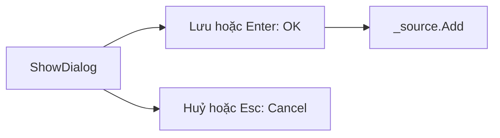

Thêm sản phẩm cần một cửa sổ riêng để nhập tên và giá. Xoá sản phẩm thì nên
hỏi lại cho chắc. Bài này mở form thứ hai dạng hộp thoại và dùng hộp thông báo
có sẵn của Windows.

## Khái niệm

💬 **MessageBox**: hộp thông báo có sẵn của Windows, mở bằng `MessageBox.Show` và trả về nút người dùng đã bấm.

🗔 **ShowDialog**: method mở một form dạng hộp thoại, khoá form chính cho tới khi hộp thoại đóng rồi trả về kết quả.

↩️ **DialogResult**: enum cho biết hộp thoại đóng bằng nút nào: `OK`, `Cancel`, `Yes`, `No`...

`DialogResult` là enum như bài Enum của khoá C# Core. So sánh
`result == DialogResult.OK` giống so sánh `status == OrderStatus.Paid`.

## Ví dụ

Form nhập sản phẩm mới:

```csharp
class ProductForm : Form
{
    private readonly TextBox _nameBox =
        new TextBox { Width = 250 };
    private readonly NumericUpDown _priceBox =
        new NumericUpDown
        {
            Maximum = 100000000,
            Width = 250
        };

    public ProductForm()
    {
        Text = "Sản phẩm mới";
        var okButton = new Button
        {
            Text = "Lưu",
            DialogResult = DialogResult.OK
        };
        var cancelButton = new Button
        {
            Text = "Huỷ",
            DialogResult = DialogResult.Cancel
        };
        AcceptButton = okButton;
        CancelButton = cancelButton;

        var panel = new FlowLayoutPanel
        {
            Dock = DockStyle.Fill,
            FlowDirection = FlowDirection.TopDown,
            Padding = new Padding(12)
        };
        panel.Controls.Add(_nameBox);
        panel.Controls.Add(_priceBox);
        panel.Controls.Add(okButton);
        panel.Controls.Add(cancelButton);
        Controls.Add(panel);
    }

    public Product CreateProduct()
    {
        return new Product
        {
            Name = _nameBox.Text,
            Price = _priceBox.Value
        };
    }
}
```

Trong constructor của `MainForm` ở bài trước, đổi `Text` của nút thêm thành
"Thêm", rồi thay handler của nó bằng:

```csharp
addButton.Click += (sender, e) =>
{
    var dialog = new ProductForm();
    if (dialog.ShowDialog() == DialogResult.OK)
    {
        _source.Add(dialog.CreateProduct());
    }
};
```

- Nút có `DialogResult` thì bấm vào là hộp thoại tự đóng, `ShowDialog` trả về
  đúng giá trị đó.
- Nhấn Enter là bấm `AcceptButton`, nhấn Esc là bấm `CancelButton`.
- `CreateProduct()` là method public của `ProductForm`. Hộp thoại đóng rồi,
  form chính gọi nó để lấy sản phẩm, không đụng vào ô nhập bên trong.



## Hỏi lại trước khi xoá

```csharp
// Trong constructor của MainForm
var deleteButton = new Button
{
    Text = "Xoá",
    Dock = DockStyle.Top
};
deleteButton.Click += (sender, e) =>
{
    var answer = MessageBox.Show(
        "Xoá sản phẩm đang chọn?", "Xác nhận",
        MessageBoxButtons.YesNo);
    if (answer == DialogResult.Yes)
    {
        _source.RemoveCurrent();
    }
};
Controls.Add(deleteButton);
```

`RemoveCurrent()` xoá sản phẩm đang chọn khỏi `BindingSource`, lưới cập nhật
theo.

## Thử ngay

Chạy app, bấm "Thêm" để mở hộp thoại. Gõ tên "Kéo", giá 8000, rồi nhấn Esc
thay vì bấm "Lưu".

**Đoán trước khi chạy:** lưới có thêm dòng "Kéo" không?

<details>
<summary>Xem kết quả</summary>

```text
Hộp thoại đóng, lưới không có dòng "Kéo".
```

Nhấn Esc là bấm `CancelButton`, nên `ShowDialog` trả về
`DialogResult.Cancel`. Điều kiện `== DialogResult.OK` sai, `_source.Add`
không chạy và dữ liệu vừa gõ bị bỏ đi.

</details>

## Lỗi hay gặp

**Dùng `Show()` thay cho `ShowDialog()`.** `Show()` mở form rồi chạy tiếp
ngay, không chờ và không trả về kết quả nào.

```csharp
// SAI — lỗi compile: Show() không trả về giá trị
var dialog = new ProductForm();
if (dialog.Show() == DialogResult.OK)
{
}
```

```csharp
// ĐÚNG — chờ hộp thoại đóng rồi đọc kết quả
var dialog = new ProductForm();
if (dialog.ShowDialog() == DialogResult.OK)
{
}
```

## Tóm tắt

- `ShowDialog()` mở form dạng hộp thoại, chờ nó đóng rồi trả về
  `DialogResult`.
- Gán `DialogResult` cho nút để bấm là hộp thoại tự đóng.
- `AcceptButton` ứng với phím Enter, `CancelButton` ứng với phím Esc.
- `MessageBox.Show` với `MessageBoxButtons.YesNo` để hỏi lại trước khi xoá.

```quiz
[
  {
    "prompt": "Hộp thoại có nút \"Đồng ý\" với DialogResult = DialogResult.OK. Người dùng bấm nút đó thì chuyện gì xảy ra?",
    "options": [
      "Hộp thoại đóng, ShowDialog trả về DialogResult.OK",
      "Không có gì, phải tự gọi Close()",
      "Cả app thoát",
      "ShowDialog trả về true"
    ],
    "answer": 1,
    "explain": "Nút có DialogResult tự đóng hộp thoại và đó chính là giá trị ShowDialog trả về."
  },
  {
    "prompt": "Muốn gõ Enter trong hộp thoại là lưu luôn, đặt gì?",
    "options": [
      "CancelButton = okButton",
      "okButton.Focus()",
      "KeyPreview = true",
      "AcceptButton = okButton"
    ],
    "answer": 4,
    "explain": "AcceptButton là nút được bấm khi gõ Enter trong form."
  },
  {
    "prompt": "var r = MessageBox.Show(\"Thoát?\", \"Hỏi\", MessageBoxButtons.YesNo); Người dùng bấm No. r bằng gì?",
    "options": [
      "false",
      "DialogResult.Cancel",
      "DialogResult.No",
      "null"
    ],
    "answer": 3,
    "explain": "MessageBox.Show trả về DialogResult ứng với nút được bấm, ở đây là DialogResult.No."
  }
]
```
