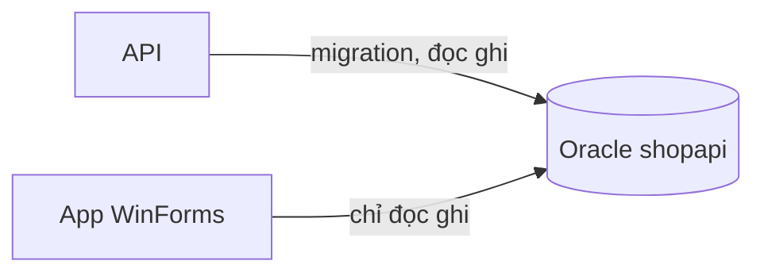

Tới giờ danh sách sản phẩm chỉ nằm trong bộ nhớ, tắt app là mất. Bài này
nối app với database `shopapi` mà API của khoá ASP.NET Core đang dùng. Hai app
cùng đọc ghi một bảng `PRODUCTS`.

## Khái niệm

🧾 **DbContextOptionsBuilder**: class dựng cấu hình cho `DbContext`, gồm loại database, chuỗi kết nối và quy ước đặt tên.

Ở khoá ASP.NET Core, `AddDbContext` dựng cấu hình này và container tạo
`ShopDbContext` cho controller. WinForms không có container sẵn, nên ta tự
dựng cấu hình rồi tự `new`, như cách truyền phụ thuộc bằng tay ở bài DIP và
dependency injection của khoá OOP.



## Ví dụ

Cài hai package như khoá ASP.NET Core:

```bash
dotnet add package Oracle.EntityFrameworkCore
dotnet add package EFCore.NamingConventions
```

Các bảng `PRODUCTS` (có cột `STOCK`), `ORDERS`, `ORDER_LINES` đã được
migration của API tạo ở chương EF Core, app này chỉ đọc ghi. Thay toàn bộ
`Program.cs`:

```csharp
using Microsoft.EntityFrameworkCore;

namespace ShopDesk;

static class Program
{
    [STAThread]
    static void Main()
    {
        ApplicationConfiguration.Initialize();

        var cs = "User Id=shopapi;Password=shopapi_pw;"
            + "Data Source=localhost:1521/FREEPDB1";
        var options =
            new DbContextOptionsBuilder<ShopDbContext>()
                .UseOracle(cs)
                .UseUpperSnakeCaseNamingConvention()
                .Options;
        var db = new ShopDbContext(options);

        Application.Run(new MainForm(db));
    }
}

class MainForm : Form
{
    private readonly ShopDbContext _db;
    private readonly BindingSource _source =
        new BindingSource();

    public MainForm(ShopDbContext db)
    {
        _db = db;
        Text = "Kho hàng";
        Width = 500;

        var grid = new DataGridView
        {
            Dock = DockStyle.Fill,
            DataSource = _source,
            ReadOnly = true,
            AllowUserToAddRows = false
        };
        Controls.Add(grid);
        Load += MainForm_Load;
    }

    private void MainForm_Load(
        object? sender, EventArgs e)
    {
        _source.DataSource = _db.Products.ToList();
    }
}

public class ShopDbContext : DbContext
{
    public ShopDbContext(
        DbContextOptions<ShopDbContext> options)
        : base(options)
    {
    }

    public DbSet<Product> Products => Set<Product>();
}

public class Product
{
    public int Id { get; set; }
    public string Name { get; set; } = "";
    public decimal Price { get; set; }
    public int Stock { get; set; }
}
```

- `ShopDbContext` và `Product` chép nguyên từ khoá ASP.NET Core. Cùng class,
  cùng quy ước tên nên khớp đúng bảng `PRODUCTS` có sẵn.
- `Main` là nơi ghép các phần: dựng `options`, tạo `db`, rồi đưa vào
  constructor của `MainForm`. Form không tự tạo `ShopDbContext` mà nhận từ
  bên ngoài.
- Mật khẩu viết thẳng trong code là trái với bài Cấu hình của khoá ASP.NET
  Core. Ở đây chỉ để thử trên máy, bài Đóng gói ứng dụng sẽ nói lại.
- Ở khoá ASP.NET Core mỗi request có một `DbContext` riêng. Ở đây một
  `DbContext` sống suốt vòng đời của form, nên nó nhớ các dòng đã đọc.
- Event `Load` chạy ngay trước khi cửa sổ hiện lần đầu, hợp để đọc dữ liệu.

## Thử ngay

Bảng `PRODUCTS` của `shopapi` đã có Bút bi, Vở, Thước thêm ở khoá ASP.NET
Core. Trong VS Code, tạo kết nối với user `shopapi`, mật khẩu `shopapi_pw`,
service name `FREEPDB1`, rồi chạy câu sau nhưng **chưa** `COMMIT`:

```sql
INSERT INTO PRODUCTS (NAME, PRICE, STOCK)
VALUES ('Balo', 350000, 8);
```

Chạy app bằng `dotnet run`.

**Đoán trước khi chạy:** lưới có "Balo" không? Nếu chưa có, cần làm gì để
nó hiện?

<details>
<summary>Xem kết quả</summary>

```text
Lưới có Bút bi, Vở, Thước, không có Balo.
Chạy COMMIT trong VS Code, đóng app rồi mở lại: Balo hiện.
```

App mở một kết nối riêng tới Oracle. Như bài Transaction của khoá SQL, thay
đổi chưa `COMMIT` chỉ phiên thực hiện nó mới thấy.

</details>

## Lỗi hay gặp

**Quên `UseUpperSnakeCaseNamingConvention()`.** EF Core tìm bảng
`"Products"` thay vì `PRODUCTS`. Mở app là hiện hộp thoại lỗi `ORA-00942`,
cùng mã lỗi đã gặp ở bài EF Core và DbContext của khoá ASP.NET Core.

```csharp
// SAI — tìm bảng "Products", không có
var options =
    new DbContextOptionsBuilder<ShopDbContext>()
        .UseOracle("...")
        .Options;
```

```csharp
// ĐÚNG — cùng quy ước với API
var options =
    new DbContextOptionsBuilder<ShopDbContext>()
        .UseOracle("...")
        .UseUpperSnakeCaseNamingConvention()
        .Options;
```

## Tóm tắt

- App WinForms dùng lại `ShopDbContext`, `Product` và database của API.
- Tự dựng `options` bằng `DbContextOptionsBuilder`, tự tạo `ShopDbContext`
  trong `Main`.
- Form nhận `ShopDbContext` qua constructor.
- Đọc dữ liệu trong event `Load`. App chỉ thấy dữ liệu đã `COMMIT`.

```quiz
[
  {
    "prompt": "Trong ASP.NET Core, AddDbContext làm hộ việc gì mà trong WinForms ta phải tự làm?",
    "options": [
      "Tạo bảng trong database",
      "Viết câu SQL cho mỗi truy vấn",
      "Cài package Oracle cho project",
      "Dựng options, tạo ShopDbContext"
    ],
    "answer": 4,
    "explain": "AddDbContext dựng cấu hình và để container tạo ShopDbContext. WinForms không có container sẵn nên ta tự làm trong Main."
  },
  {
    "prompt": "App đang mở thì đồng nghiệp đổi giá Bút bi và COMMIT. App gọi lại _db.Products.ToList() trên cùng _db. Lưới hiện giá nào?",
    "options": [
      "Giá cũ",
      "Giá mới vừa COMMIT",
      "Lưới trống, phải mở lại app",
      "Báo lỗi vì dữ liệu đã đổi"
    ],
    "answer": 1,
    "explain": "DbContext sống suốt vòng đời của form nên nhớ các dòng đã đọc. Truy vấn thường trả về đúng object cũ, giá vẫn là giá cũ."
  },
  {
    "prompt": "Muốn app kho chạy với Oracle trên máy chủ thử nghiệm thay vì localhost. Sửa ở đâu?",
    "options": [
      "Constructor của MainForm",
      "Chuỗi cs trong Main",
      "Class ShopDbContext",
      "Handler MainForm_Load"
    ],
    "answer": 2,
    "explain": "Main dựng options từ chuỗi kết nối rồi truyền ShopDbContext vào form. Form chỉ nhận từ ngoài nên không phải sửa."
  }
]
```
