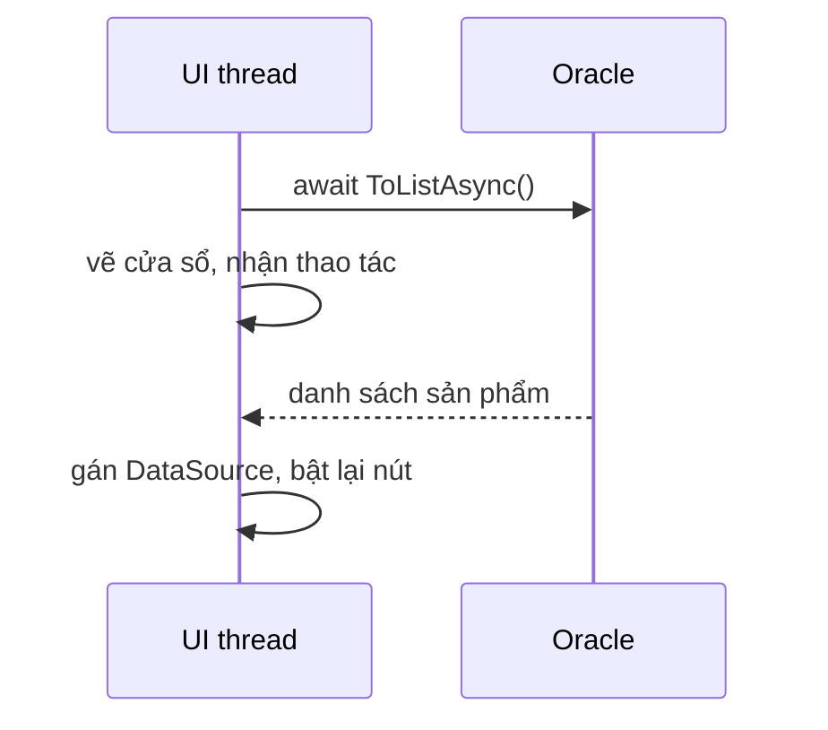

Đọc database cần thời gian, mạng chậm có khi mất vài giây. Trong lúc đó, nếu
cửa sổ đứng im không kéo được, nhân viên sẽ tưởng app bị treo. Bài này dùng
`async`/`await` của khoá C# Core để cửa sổ vẫn phản hồi trong lúc chờ.

## Khái niệm

🧵 **UI thread (luồng giao diện)**: luồng duy nhất vừa chạy các handler vừa vẽ lại cửa sổ.

Handler chạy lâu thì cửa sổ không được vẽ lại, trông như bị treo.

⏳ **Async event handler**: handler khai báo `async void` để dùng được `await` bên trong.

Trong lúc `await`, UI thread rảnh để vẽ cửa sổ và nhận thao tác. Event quy
định handler trả về `void`, nên đây là chỗ duy nhất dùng `async void`. Method
async tự viết vẫn trả về `Task` như khoá C# Core.

## Ví dụ

Sửa `MainForm` của bài trước: đọc dữ liệu bằng `await`, thêm nút "Tải lại".

```csharp
using Microsoft.EntityFrameworkCore;

class MainForm : Form
{
    private readonly ShopDbContext _db;
    private readonly BindingSource _source =
        new BindingSource();
    private readonly Button _reloadButton = new Button
    {
        Text = "Tải lại",
        Dock = DockStyle.Top
    };

    public MainForm(ShopDbContext db)
    {
        _db = db;
        Text = "Kho hàng";
        Width = 500;

        var grid = new DataGridView
        {
            Dock = DockStyle.Fill,
            DataSource = _source,
            ReadOnly = true,
            AllowUserToAddRows = false
        };
        Controls.Add(grid);
        Controls.Add(_reloadButton);

        Load += async (sender, e) => await LoadAsync();
        _reloadButton.Click +=
            async (sender, e) => await LoadAsync();
    }

    private async Task LoadAsync()
    {
        _reloadButton.Enabled = false;
        Text = "Kho hàng - đang tải...";

        _source.DataSource = await _db.Products
            .AsNoTracking()
            .ToListAsync();

        Text = "Kho hàng";
        _reloadButton.Enabled = true;
    }
}
```

- `ToListAsync()` giống bản của khoá ASP.NET Core. Trong lúc chờ Oracle trả
  kết quả, cửa sổ vẫn kéo, vẫn thu nhỏ được.
- Sau `await`, code chạy tiếp trên UI thread, nên gán `_source.DataSource`
  và đổi `Text` an toàn.
- Tắt nút trong lúc tải để không ai bấm hai lần. Một `DbContext` chỉ chạy
  được một truy vấn một lúc, bấm lần hai khi lần một chưa xong sẽ báo
  `InvalidOperationException`.
- `AsNoTracking()` đọc mới từ Oracle, bỏ qua các dòng `DbContext` đã nhớ.
  Nhờ vậy "Tải lại" thấy cả giá vừa sửa trong VS Code.
- Lambda `async (sender, e) => ...` là handler `async void` viết gọn.



## Thử ngay

Thêm một nút chỉ để thử cảm giác "treo":

```csharp
// Trong constructor
var slowButton = new Button
{
    Text = "Chờ 5 giây",
    Dock = DockStyle.Top
};
slowButton.Click += (sender, e) =>
{
    Thread.Sleep(5000);
    Text = "Xong";
};
Controls.Add(slowButton);
```

`Thread.Sleep(5000)` bắt luồng đang chạy đứng yên 5 giây. Bấm nút rồi thử kéo
cửa sổ. Sau đó đổi handler thành
`async (sender, e) => { await Task.Delay(5000); Text = "Xong"; }` và làm
lại.

**Đoán trước khi chạy:** hai cách chờ 5 giây này khác nhau ở điểm nào khi
bạn kéo cửa sổ?

<details>
<summary>Xem kết quả</summary>

```text
Thread.Sleep: cửa sổ đứng im, không kéo được, tiêu đề
              có thể bị Windows thêm "(Not Responding)".
await Task.Delay: kéo cửa sổ bình thường, 5 giây sau
              tiêu đề đổi thành "Xong".
```

`Thread.Sleep` giữ UI thread suốt 5 giây. `await` trả UI thread về cho
WinForms trong lúc chờ.

</details>

## Lỗi hay gặp

**Quên `await`.** Compiler không báo lỗi. Lưới nhận một object `Task` thay
vì danh sách sản phẩm, và hiện các cột lạ như `Status`, `IsCompleted`.

```csharp
// SAI — gán Task vào lưới
_source.DataSource = _db.Products.ToListAsync();
```

```csharp
// ĐÚNG
_source.DataSource =
    await _db.Products.ToListAsync();
```

**Dùng `.Result` để khỏi viết `async`.** Như bài async/await cơ bản của khoá
C# Core, `.Result` bắt luồng đứng chờ. Ở đây đó là UI thread, nên cửa sổ lại
treo như bản không async. Đã gọi method async thì `await` nó.

## Tóm tắt

- UI thread vừa chạy handler vừa vẽ cửa sổ. Handler chạy lâu làm cửa sổ treo.
- Handler dùng `async void` để `await` bên trong. Method tự viết trả về
  `Task`.
- Đọc database bằng bản `Async` và `await` nó.
- Tắt nút trong lúc chờ, vì một `DbContext` chỉ chạy một truy vấn một lúc.

```quiz
[
  {
    "prompt": "Handler nút \"Xuất báo cáo\" chạy vòng lặp tính toán 10 giây ngay trong handler. Trong 10 giây đó cửa sổ thế nào?",
    "options": [
      "Bình thường, vì WinForms tự chạy song song",
      "Cửa sổ đóng lại",
      "Không vẽ lại, không kéo được, trông như bị treo",
      "Chỉ nút bị mờ đi"
    ],
    "answer": 3,
    "explain": "Handler chiếm UI thread suốt 10 giây, nên cửa sổ không được vẽ lại và không nhận thao tác."
  },
  {
    "prompt": "Method tự viết LoadOrdersAsync có await bên trong. Kiểu trả về nên là gì?",
    "options": [
      "Task",
      "async void",
      "void",
      "object"
    ],
    "answer": 1,
    "explain": "async void chỉ dành cho event handler. Method async tự viết trả về Task để nơi gọi await được."
  },
  {
    "prompt": "Nhân viên bấm \"Tải lại\" hai lần thật nhanh, cả hai lần dùng chung một DbContext. Chuyện gì có thể xảy ra?",
    "options": [
      "Dữ liệu được tải hai lần, không sao",
      "Lần hai tự chờ lần một xong",
      "Oracle tự huỷ lần một",
      "InvalidOperationException vì DbContext đang bận truy vấn trước"
    ],
    "answer": 4,
    "explain": "Một DbContext không chạy được hai truy vấn cùng lúc. Tắt nút trong lúc tải để tránh chuyện này."
  }
]
```
