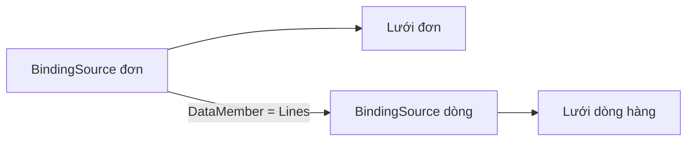

Màn hình đơn hàng cần hai bảng: trên là danh sách đơn, dưới là các dòng hàng
của đơn đang chọn. Chọn đơn khác thì bảng dưới đổi theo. Bài này ghép quan hệ
một-nhiều của EF Core với hai `BindingSource` để làm việc đó.

## Khái niệm

🗂️ **Master-detail (chính-phụ)**: màn hình hai phần, chọn một dòng ở bảng chính (master) thì bảng phụ (detail) hiện các dòng con của nó.

🧷 **DataMember**: tên property danh sách con mà `BindingSource` phụ lấy ra từ dòng đang chọn của `BindingSource` chính.

Đây vẫn là quan hệ một-nhiều giữa `orders` và `order_lines` ở khoá SQL, đã
khai báo thành `Order.Lines` ở khoá ASP.NET Core. Bài này đưa nó lên màn hình.

## Ví dụ

Chép class `Order`, `OrderLine` và hai `DbSet` `Orders`, `OrderLines` từ bài
Quan hệ một-nhiều của khoá ASP.NET Core vào code. Đơn mẫu đã được tạo bằng
`POST /api/orders/sample` ở bài đó. Muốn có thêm đơn thì gọi lại API này.

```csharp
using Microsoft.EntityFrameworkCore;

class MainForm : Form
{
    private readonly ShopDbContext _db;
    private readonly BindingSource _orders =
        new BindingSource();
    private readonly BindingSource _lines =
        new BindingSource();

    public MainForm(ShopDbContext db)
    {
        _db = db;
        Text = "Đơn hàng";
        Width = 600;
        Height = 450;

        var ordersGrid = new DataGridView
        {
            Dock = DockStyle.Top,
            Height = 150,
            DataSource = _orders,
            ReadOnly = true,
            AllowUserToAddRows = false
        };
        var linesGrid = new DataGridView
        {
            Dock = DockStyle.Fill,
            DataSource = _lines,
            ReadOnly = true,
            AllowUserToAddRows = false
        };
        Controls.Add(linesGrid);
        Controls.Add(ordersGrid);

        Load += async (sender, e) =>
        {
            _orders.DataSource = await _db.Orders
                .Include(o => o.Lines)
                .ToListAsync();
            _lines.DataSource = _orders;
            _lines.DataMember = "Lines";
        };
    }
}
```

- `Include(o => o.Lines)` đọc đơn kèm các dòng hàng, như ở khoá ASP.NET Core.
- `_lines.DataSource = _orders` và `DataMember = "Lines"`: danh sách dưới là
  `Lines` của đơn đang chọn ở trên.
- Lưới trên chỉ có cột `Id`, `CustomerId`. Property danh sách `Lines` không
  thành cột.



## Thử ngay

Xoá dòng `.Include(o => o.Lines)` rồi chạy lại.

**Đoán trước khi chạy:** lưới dưới hiện các dòng hàng, báo lỗi, hay trống?

<details>
<summary>Xem kết quả</summary>

```text
Lưới trên vẫn đủ các đơn.
Lưới dưới trống, dù chọn đơn nào.
```

Không có `Include`, EF Core chỉ đọc bảng `ORDERS`. `Lines` của mỗi đơn vẫn
là list rỗng từ lúc khởi tạo, giống kết quả Thử ngay ở bài Quan hệ một-nhiều
của khoá ASP.NET Core.

</details>

## Lỗi hay gặp

**Đặt `DataMember` trước khi có dữ liệu.** Lúc đó `_orders` chưa có
`DataSource`, nên `BindingSource` không biết `Lines` là gì. App dừng ngay khi
mở với `ArgumentException`: không tìm thấy `DataMember` tên `Lines`.

```csharp
// SAI — đặt trong constructor, _orders còn rỗng
_lines.DataSource = _orders;
_lines.DataMember = "Lines";
```

```csharp
// ĐÚNG — đặt sau khi _orders đã có danh sách đơn
_orders.DataSource = await _db.Orders
    .Include(o => o.Lines)
    .ToListAsync();
_lines.DataSource = _orders;
_lines.DataMember = "Lines";
```

## Tóm tắt

- Master-detail: chọn dòng ở bảng chính, bảng phụ hiện các dòng con.
- `BindingSource` phụ lấy `DataSource` là `BindingSource` chính, `DataMember`
  là tên property danh sách con.
- Phải `Include` danh sách con, nếu không bảng phụ luôn trống.
- Đặt `DataMember` sau khi `BindingSource` chính đã có dữ liệu.

```quiz
[
  {
    "prompt": "Màn hình khách hàng: trên là khách, dưới là đơn của khách đó (Customer.Orders). BindingSource _customerOrders cần gì?",
    "options": [
      "DataSource = _customers, DataMember = \"Orders\"",
      "DataSource = _db.Orders",
      "DataMember = \"Customer\"",
      "DataSource = _customers, DataMember = \"Customers\""
    ],
    "answer": 1,
    "explain": "BindingSource phụ lấy nguồn là BindingSource chính, DataMember là tên property danh sách con Orders."
  },
  {
    "prompt": "Chọn đơn khác ở lưới trên thì lưới dưới đổi theo. Việc đổi đó do đâu?",
    "options": [
      "Handler SelectionChanged mà ta tự viết",
      "_lines theo dòng đang chọn của _orders",
      "EF Core đọc lại ORDER_LINES mỗi lần",
      "DataGridView tự lọc dòng theo OrderId"
    ],
    "answer": 2,
    "explain": "BindingSource phụ có DataMember = \"Lines\" nên tự lấy Lines của đơn đang chọn. Các dòng hàng đã có sẵn trong bộ nhớ nhờ Include, không đọc lại database."
  },
  {
    "prompt": "Form đang mở thì có người tạo thêm một đơn qua API. Lưới đơn trên form thì sao?",
    "options": [
      "Hiện ngay vì EF Core theo dõi bảng",
      "Hiện khi chọn sang một đơn khác",
      "Không hiện tới khi đọc lại danh sách",
      "Báo lỗi vì dữ liệu trong bảng đã đổi"
    ],
    "answer": 3,
    "explain": "Danh sách đơn được đọc một lần lúc Load. EF Core không tự báo khi database đổi, nên phải đọc lại mới thấy đơn mới."
  }
]
```
