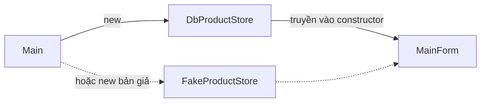

`MainForm` đang gọi thẳng `ShopDbContext`. Muốn chạy thử màn hình khi chưa
bật Oracle hay đổi cách lưu dữ liệu, bạn đều phải sửa form. Bài này đặt phần
đọc ghi sau interface `IProductStore`, đúng như API đã làm ở khoá ASP.NET
Core.

## Khái niệm

🔩 **Composition root**: nơi duy nhất trong app tạo các object và ghép chúng lại với nhau.

Trong app WinForms, chỗ đó là `Main`. Đây vẫn là DIP của khoá OOP: ở đó ta
tự `new` rồi truyền vào constructor. Ở khoá ASP.NET Core, container làm hộ
việc này qua `AddScoped<IProductStore, DbProductStore>()`.

## Ví dụ

Chép nguyên `IProductStore` và `DbProductStore` từ bài Truy vấn với EF Core
của khoá ASP.NET Core, không sửa dòng nào. Interface chỉ có hai method:

```csharp
public interface IProductStore
{
    Task<List<Product>> InStockAsync();
    Task<bool> SetStockAsync(int id, int stock);
}
```

`Main` ghép các phần, `MainForm` chỉ biết `IProductStore`:

```csharp
using Microsoft.EntityFrameworkCore;

namespace ShopDesk;

static class Program
{
    [STAThread]
    static void Main()
    {
        ApplicationConfiguration.Initialize();

        var cs = "User Id=shopapi;Password=shopapi_pw;"
            + "Data Source=localhost:1521/FREEPDB1";
        var options =
            new DbContextOptionsBuilder<ShopDbContext>()
                .UseOracle(cs)
                .UseUpperSnakeCaseNamingConvention()
                .Options;
        var db = new ShopDbContext(options);
        IProductStore store = new DbProductStore(db);

        Application.Run(new MainForm(store));
    }
}

class MainForm : Form
{
    private readonly IProductStore _store;
    private readonly BindingSource _source =
        new BindingSource();

    public MainForm(IProductStore store)
    {
        _store = store;
        Text = "Hàng còn trong kho";
        Width = 500;

        var grid = new DataGridView
        {
            Dock = DockStyle.Fill,
            DataSource = _source,
            ReadOnly = true,
            AllowUserToAddRows = false
        };
        var soldOutButton = new Button
        {
            Text = "Hết hàng",
            Dock = DockStyle.Top
        };
        soldOutButton.Click += SoldOutButton_Click;
        Controls.Add(grid);
        Controls.Add(soldOutButton);

        Load += async (sender, e) => await LoadAsync();
    }

    private async Task LoadAsync()
    {
        _source.DataSource =
            await _store.InStockAsync();
    }

    private async void SoldOutButton_Click(
        object? sender, EventArgs e)
    {
        object? item = _source.Current;
        if (item == null)
        {
            return;
        }
        var product = (Product)item;
        await _store.SetStockAsync(product.Id, 0);
        await LoadAsync();
    }
}
```

- `MainForm` không có chữ `DbContext` nào. Nó chỉ gọi hai method của
  interface.
- `_source.Current` là dòng đang chọn trên lưới, kiểu `object`, ép về
  `Product` như bài ListBox.
- Bấm "Hết hàng" thì tồn kho về 0, danh sách tải lại, dòng đó biến mất.
  Cho gọn, ví dụ không tắt nút trong lúc chờ như bài Async giữ giao diện
  mượt; app thật nên tắt.
- API và app kho dùng cùng một đoạn code `DbProductStore`, chép nguyên.
  Nhưng `DbContext` ở đây sống suốt vòng đời của form, nên `InStockAsync`
  (không có `AsNoTracking()`) không thấy thay đổi do nơi khác ghi vào.



## Thử ngay

Viết một bản giả giữ dữ liệu trong bộ nhớ, giống ý tưởng
`InMemoryProductStore` ở bài Dependency injection trong ASP.NET Core:

```csharp
class FakeProductStore : IProductStore
{
    private readonly List<Product> _products =
        new List<Product>
        {
            new Product
            {
                Id = 1, Name = "Bút bi",
                Price = 5000m, Stock = 120
            },
            new Product
            {
                Id = 2, Name = "Thước",
                Price = 7000m, Stock = 50
            }
        };

    public Task<List<Product>> InStockAsync()
    {
        var result = _products
            .Where(p => p.Stock > 0)
            .ToList();
        return Task.FromResult(result);
    }

    public Task<bool> SetStockAsync(int id, int stock)
    {
        foreach (var p in _products)
        {
            if (p.Id == id)
            {
                p.Stock = stock;
                return Task.FromResult(true);
            }
        }
        return Task.FromResult(false);
    }
}
```

`Task.FromResult` bọc sẵn một kết quả thành `Task`, dùng khi không có gì
phải chờ. Tắt Oracle bằng `docker stop oracle`, rồi trong `Main` đổi dòng
tạo `store` thành `IProductStore store = new FakeProductStore();`.

**Đoán trước khi chạy:** Oracle đã tắt. App có mở được, có bấm "Hết hàng"
được không?

<details>
<summary>Xem kết quả</summary>

```text
App mở bình thường, lưới có Bút bi và Thước.
Chọn Thước, bấm "Hết hàng": dòng Thước biến mất.
```

`MainForm` không đổi một chữ nào mà vẫn chạy trên dữ liệu giả. Thử xong,
chạy `docker start oracle` và đổi `Main` về lại `DbProductStore`.

</details>

## Lỗi hay gặp

**Form tự `new` phần dữ liệu.** Form lại gắn chặt với Oracle và không thay
được bằng bản giả.

```csharp
// SAI — form tự tạo DbProductStore
class MainForm : Form
{
    private readonly IProductStore _store;

    public MainForm(ShopDbContext db)
    {
        _store = new DbProductStore(db);
    }
}
```

```csharp
// ĐÚNG — form nhận interface từ Main
class MainForm : Form
{
    private readonly IProductStore _store;

    public MainForm(IProductStore store)
    {
        _store = store;
    }
}
```

## Tóm tắt

- Form chỉ phụ thuộc `IProductStore`, không biết `DbContext`.
- `Main` là composition root: tạo `DbContext`, `DbProductStore`, form, rồi
  ghép lại.
- API và app WinForms dùng cùng code `DbProductStore`.
- Đổi sang `FakeProductStore` là chạy được giao diện khi không có Oracle.

```quiz
[
  {
    "prompt": "App WinForms có thêm màn hình đơn hàng cần IOrderStore. Nên tạo DbOrderStore ở đâu?",
    "options": [
      "Trong constructor của form đơn hàng",
      "Trong DbProductStore có sẵn",
      "Trong handler Load của form",
      "Trong Main"
    ],
    "answer": 4,
    "explain": "Main là composition root: mọi object được tạo và ghép ở đó, rồi truyền vào constructor của form. Form chỉ nhận interface."
  },
  {
    "prompt": "Muốn chạy thử màn hình kho trên máy chưa cài Oracle, cần sửa ở đâu?",
    "options": [
      "Chỉ sửa Main",
      "Sửa MainForm cho đọc bộ nhớ",
      "Sửa IProductStore",
      "Sửa DbProductStore"
    ],
    "answer": 1,
    "explain": "Form chỉ biết IProductStore, nên chỉ cần đổi object được tạo ở composition root: Main truyền FakeProductStore vào form."
  },
  {
    "prompt": "_source.Current trả về gì?",
    "options": [
      "Số thứ tự dòng đang chọn",
      "Dòng đang chọn, kiểu object",
      "Cả danh sách đang gắn vào",
      "Dòng đang chọn, kiểu Product"
    ],
    "answer": 2,
    "explain": "Current là object đang chọn trong BindingSource, khai báo kiểu object nên phải ép về Product."
  }
]
```
