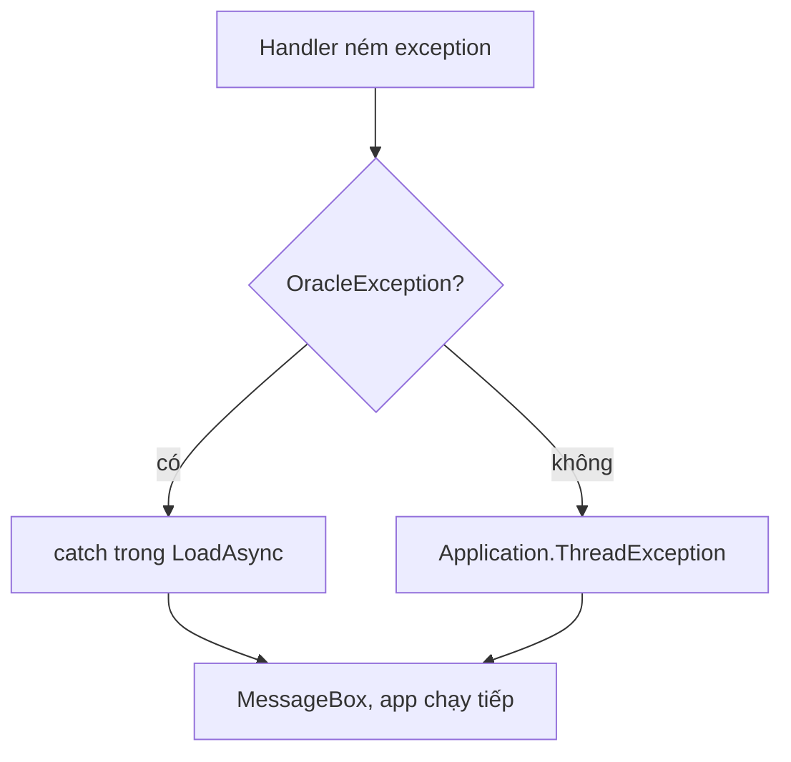

Oracle tắt, mạng rớt, dữ liệu vi phạm ràng buộc: sớm muộn app cũng gặp lỗi.
Không xử lý thì nhân viên thấy một hộp lỗi dài, khó hiểu của .NET. Bài
này giúp app báo lỗi dễ hiểu và vẫn chạy tiếp.

## Khái niệm

🚨 **Application.ThreadException**: event nhận mọi exception chưa được bắt trong các handler của giao diện, kể cả handler `async void`.

App xử lý lỗi theo hai tầng, giống khoá ASP.NET Core. Lỗi lường trước được
thì bắt tại chỗ bằng `try/catch`, như bài Exception của khoá C# Core. Lỗi
còn lại đi về một chỗ chung, như bài Xử lý lỗi tập trung.

## Ví dụ

Bắt lỗi kết nối ngay trong `LoadAsync` của bài trước:

```csharp
using Oracle.ManagedDataAccess.Client;

// Trong MainForm, thay LoadAsync cũ
private async Task LoadAsync()
{
    try
    {
        _source.DataSource =
            await _store.InStockAsync();
    }
    catch (OracleException)
    {
        MessageBox.Show(
            "Không kết nối được database. "
            + "Kiểm tra Oracle rồi thử lại.",
            "Lỗi kết nối",
            MessageBoxButtons.OK,
            MessageBoxIcon.Error);
    }
}
```

Chỗ chung cho các lỗi còn lại đặt trong `Main`, trước `Application.Run`:

```csharp
Application.ThreadException += (sender, e) =>
{
    MessageBox.Show(
        "Có lỗi xảy ra: " + e.Exception.Message,
        "Lỗi",
        MessageBoxButtons.OK,
        MessageBoxIcon.Error);
};
```

- `OracleException` nằm trong `Oracle.ManagedDataAccess.Client`, cùng thư
  viện với `OracleCommand` ở bài SQL injection. EF Core ném thẳng nó ra khi
  không kết nối được.
- Ở đây chỉ bắt `OracleException`. Lỗi loại khác đi tiếp ra ngoài và rơi
  vào `ThreadException`.
- Handler của `ThreadException` hiện thông báo, sau đó app vẫn chạy tiếp.
- `MessageBoxIcon.Error` thêm biểu tượng lỗi màu đỏ vào hộp thông báo.



## Thử ngay

Tắt Oracle bằng `docker stop oracle`, rồi chạy app.

**Đoán trước khi chạy:** app sẽ sập, bị treo hay hiện gì?

<details>
<summary>Xem kết quả</summary>

```text
Vài giây sau, hộp "Lỗi kết nối" hiện ra:
"Không kết nối được database. Kiểm tra Oracle rồi thử lại."
Bấm OK: cửa sổ kho vẫn mở, lưới trống.
```

`InStockAsync` thử kết nối vài giây, không được thì ném `OracleException`
với mã `ORA-50201`. `catch` bắt được nên app không sập. Chạy
`docker start oracle` rồi mở lại app là có dữ liệu.

</details>

## Lỗi hay gặp

**`catch (Exception)` rồi bỏ trống.** Như bài Exception của khoá C# Core, mọi
lỗi đều bị giấu đi, kể cả lỗi do code sai. Nhân viên thấy lưới trống mà không biết vì sao.

```csharp
// SAI — lỗi gì cũng im lặng
try
{
    _source.DataSource =
        await _store.InStockAsync();
}
catch (Exception)
{
}
```

```csharp
// ĐÚNG — chỉ bắt lỗi biết cách xử lý, và báo ra
try
{
    _source.DataSource =
        await _store.InStockAsync();
}
catch (OracleException)
{
    MessageBox.Show("Không kết nối được database.");
}
```

## Tóm tắt

- Lỗi lường trước được thì `try/catch` đúng loại, như `OracleException`.
- `Application.ThreadException` là chỗ chung cho mọi lỗi chưa được bắt.
- Báo lỗi bằng `MessageBox` với lời dễ hiểu, app vẫn chạy tiếp.
- Không `catch` rồi bỏ trống.

```quiz
[
  {
    "prompt": "Handler async void của nút Lưu ném exception sau một lệnh await, không có try/catch. Main đã gắn Application.ThreadException. Chuyện gì xảy ra?",
    "options": [
      "App sập ngay lập tức",
      "Exception bị bỏ qua, không ai biết",
      "ThreadException nhận nó",
      "Lỗi compile vì thiếu try/catch"
    ],
    "answer": 3,
    "explain": "Exception trong handler async void được đưa về UI thread và đi vào handler của Application.ThreadException."
  },
  {
    "prompt": "Nên bắt OracleException ở đâu?",
    "options": [
      "Trong constructor của Product",
      "Không bắt, để app tự dừng",
      "Trong Main, bằng catch (Exception)",
      "Ở chỗ gọi database"
    ],
    "answer": 4,
    "explain": "Bắt lỗi ở nơi biết cách xử lý nó: chỗ gọi database biết cách báo lỗi cho người dùng. Mọi lỗi khác để ThreadException lo."
  },
  {
    "prompt": "Vì sao catch (Exception) { } bỏ trống là lỗi?",
    "options": [
      "Lỗi bị giấu, không ai biết mà sửa",
      "Compiler không cho viết vậy",
      "App chạy chậm hơn hẳn",
      "Exception không bắt được lỗi Oracle"
    ],
    "answer": 1,
    "explain": "Khối catch rỗng giấu mọi lỗi, kể cả lỗi do code sai. App chạy sai mà không có dấu hiệu gì."
  }
]
```
